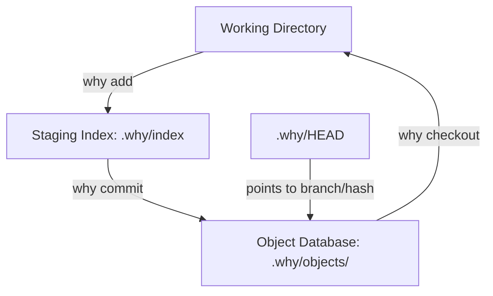

# Why VCS — Git-from-Scratch Reconstructed in Go
[](https://opensource.org/licenses/MIT)

**Why VCS** is a fully functional, serverless, content-addressable version control system (VCS) written from scratch in Go. By mimicking the internals of Git, this project implements repository initialization, Content-Addressable Storage (CAS), directory trees, index staging, branch references, checkouts, line-by-line diffing, and 3-way merge resolution.

Designed as an educational showcase of backend systems engineering, it highlights filesystem abstractions, binary serialization formats, dynamic programming algorithms (LCS), and graph-based lineage walking.

---

## System Architecture

Why VCS replicates the triple-state architecture of Git, separating the user workspace from version control metadata:



*   **Working Directory**: The local directory containing user files.
*   **Staging Area (The Index)**: A transaction log tracking files staged for the next commit.
*   **Object Database (CAS)**: An immutable store of compressed Zlib objects addressed by their SHA-1 checksum.

---

## Technical Features

### 1. Content-Addressable Storage (CAS)
*   **Header Injection**: Prepends type and length metadata (`blob <size>\x00`) to payloads. This enforces unique addressability and enables quick header parsing.
*   **Compression**: Compress objects using **Zlib** to reduce disk space.
*   **Hash Fan-out**: To prevent I/O seek latency in flat directories containing thousands of files, the 40-character SHA-1 hash is split into a 2-character directory and 38-character filename (e.g., `.why/objects/a9/993e3...`).

### 2. Binary Tree Serialization
*   **Hierarchical DAG**: Directories are represented as Tree objects, pointing to either files (blobs) or other directories (sub-trees).
*   **Binary Compaction**: SHA-1 hashes are stored as **20-byte raw binary slices** inside tree objects instead of 40-character hex strings, saving **50% space** per entry.

### 3. The Staging Area (The Index)
*   **Intermediate Transaction Buffer**: Decouples active file edits from the commit pipeline, enabling incremental stage curation.
*   **JSON-Based Index**: Stored in `.why/index` for simplified inspection, testability, and state-machine integrity.

### 4. Dynamic Programming Diff Engine
*   **LCS Algorithm**: Computes line-by-line file differences by building an $O(M \times N)$ dynamic programming grid to discover the **Longest Common Subsequence**.
*   **Backtracking Logic**: Navigates the DP grid diagonally (equality), vertically (deletions), and horizontally (insertions) to produce minimal, color-coded patch files.

### 5. Reconciliation Engine (3-Way Merging)
*   **Lowest Common Ancestor (LCA)**: Walks history backward using a **Breadth-First Search (BFS)** queue to find the exact point where two branches diverged.
*   **Decision Matrix**: Compares files across three states: Base, Ours (HEAD), and Theirs (Target Branch). It updates changed files automatically and generates conflict markers (`<<<<<<< HEAD`, `=======`, `>>>>>>>`) for files modified concurrently.

---

## 📂 Project Structure

```
├── cmd/
│   ├── add.go          # Stages working directory files to the index
│   ├── branch.go       # Manages refs/heads/ branch pointers
│   ├── catfile.go      # Inspects type, size, and content of zlib objects
│   ├── checkout.go     # Wipes worktree and recursively unpacks trees
│   ├── commit.go       # Severs staging index into commit objects
│   ├── diff.go         # Computes workspace diffs (staged/unstaged)
│   ├── hashobject.go   # Hashes and writes content to the CAS database
│   ├── log.go          # Walks commit parent pointers backward
│   ├── merge.go        # Initiates 3-way merge reconciliation
│   ├── status.go       # Performs triangular comparison of repository states
│   └── writetree.go    # Serializes index entries into tree objects
├── internal/
│   ├── index/
│   │   └── index.go    # Index struct definition & JSON storage methods
│   ├── object/
│   │   ├── blob.go     # Blob type serialization
│   │   ├── commit.go   # Commit header formatting and metadata parsing
│   │   ├── diff.go     # LCS line-by-line diff implementation
│   │   ├── hash.go     # SHA-1 hashing utility
│   │   ├── parse.go    # Object header parser
│   │   ├── read.go     # Zlib decompression and reader
│   │   ├── store.go    # Zlib compression and writer
│   │   └── tree.go     # Binary tree parsing and serialization
│   └── repo/
│       ├── merge.go    # Side-effect-free merge decision matrix
│       └── repository.go # Repository setup, head retrieval, and LCA BFS
├── tests/              # Comprehensive unit and integration test suite
├── main.go             # CLI router
└── go.mod              # Go module file
```

---

## CLI Commands

Initialize a new repository:
```bash
why init
```

Stage files to the index:
```bash
why add file1.txt file2.txt
```

Commit staged changes:
```bash
why commit -m "Your commit message"
```

View branch status and file states (staged/unstaged/untracked):
```bash
why status
```

Show line-by-line differences (unstaged changes):
```bash
why diff
```

Show staged differences (index vs HEAD):
```bash
why diff --staged
```

Print revision history walking parent pointers:
```bash
why log
```

Manage branches:
```bash
why branch              # List branches
why branch feature      # Create branch 'feature'
```

Switch branches or commit hashes (Time Travel):
```bash
why checkout <branch_name_or_commit_hash>
```

Merge a branch into the current one:
```bash
why merge <branch_name>
```

Inspect objects in the database:
```bash
why cat-file -p <hash>  # Print object contents
why cat-file -t <hash>  # Print object type
```

---

## Installation & Testing

Ensure you have [Go](https://go.dev/doc/install) installed (version 1.18 or higher recommended).

### Clone and Build
```bash
git clone https://github.com/crazyshit-dev/why.git
cd why
go build -o why main.go
```

### Run Tests
To run the Go unit and integration test suite:
```bash
go test -v ./...
```

### Interactive Test Script
Run the interactive tester to manually step through the CLI workflow:
```bash
bash test_all.sh
```

### Grand Cycle Integration Script
Run the grand cycle script to execute a full initialization, branch creation, modification, checkout, and merge conflict resolution test:
```bash
bash test_vcs_final.sh
```

---

## Engineering Takeaways

Building this VCS demonstrates key backend engineering competencies:
*   **File I/O Optimization**: Managing directory structures, understanding directory lookups ($O(1)$ sub-folders vs $O(N)$ flat lookups), and zlib serialization.
*   **Data Structures**: Structuring data as a Directed Acyclic Graph (DAG) for history representation, using parent links to trace execution.
*   **Algorithmic Design**: Implementing dynamic programming grids (LCS) to track differences and BFS graph searching to resolve Lowest Common Ancestors.
*   **Transaction Integrity**: Design patterns that keep business calculations pure and side-effect-free, mutating state atomically only after database writes succeed.
